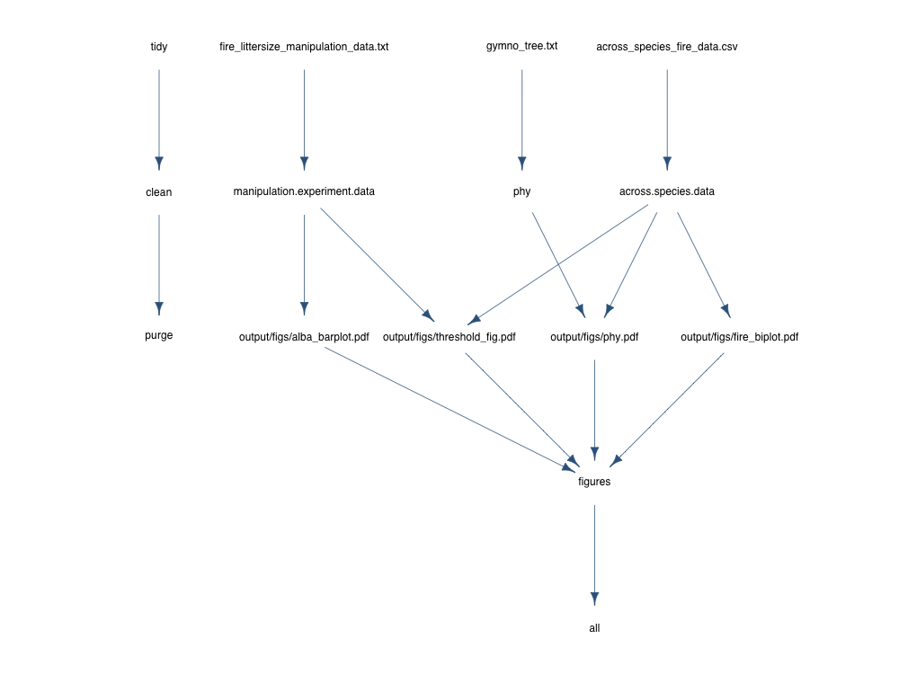

Reproducing the figures from Cornwell et al. *in press* 
================

The contents of this directory should allow you to access the data and recreate--on your own computer from the original data--the graphs from Cornwell et al. *in press* New Phytologist.  Reproducing these results will first require cloning this repository on your computer.  If you are new to git, it's a good idea to read more about git [here](http://r-pkgs.had.co.nz/git.html).

After you clone the repository, make sure the working directory for R is within the repository then run the following lines of code.

First install the required packages from CRAN:

	install.packages(c("R6", "yaml", "digest","devtools","fields","ape"))

Download and install one additional package called maker from github.  

	devtools::install_github("richfitz/maker")

Load that package, and run a R specific "makefile"

	maker::make()
	
This script will call R code that loads the data, does various analyses and, makes the figures. The script will place the figures in a folder called "output/figs" within the working directory.  

Here is a visualization of the workflow to get to these figures.  The entities across the top row are files, the second row are R data objects, and the third row are the figure files.  

The names of the functions that do each processing and graphics step can be found within the maker.yml file in the repository.  The functions themselves are in the .R files.  